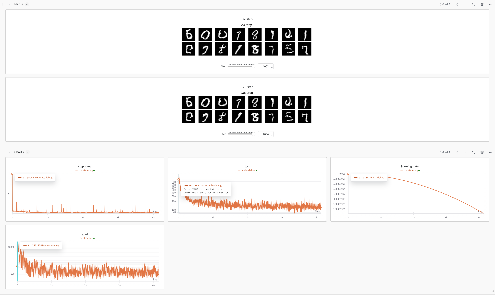

# jax-interpolants



Interested in generative modeling? Love flow matching, stochastic interpolants, and diffusion models, but can't find a good ``jax`` implementation? This repository contains a clean, efficient, and customizable implementation of the stochastic interpolant framework in ``jax`` and ``flax``. 

The codebase uses the [jax-edm2](https://github.com/nmboffi/jax-edm2) neural network as a high-performance U-Net architecture for standard image datasets. It also comes with built-in [wandb](https://wandb.ai) logging of standard diagnostics and on-the-fly image generation to help visualize the progress of model training.

The repository layout is simple. ``py/common`` contains simple libraries useful for the training loop. ``py/launchers/learn.py`` contains the main training loop. ``py/launchers/matplotlibrc`` contains some really nice defaults for beautiful plots (turn on ``text.usetex`` to make this extra-beautiful). 

# Examples

``py/configs`` contains some default configurations that should *just work* for the two-dimensional checker dataset, MNIST, and CIFAR-10. Usage of one of these examples is simple. Simply run

``` python
python py/launchers/learn.py \
--cfg_path configs.default_checker \
--dataset_location [your_desired_download_location_here] \
--output_folder [your_desired_output_folder_here] \
--wandb_entity [your_wandb_entity_here]
```

That's it. MNIST and CIFAR-10 will download to the location if they're not already there using ``tfds``. The checker dataset doesn't need to download anything at all. You can also create your own custom configs, for example for ImageNet, using the same API.

# References
The code is based on the following reference:

``` bibtex
@article{albergo2023stochastic,
  author = {Albergo, Michael S. and Boffi, Nicholas M. and Vanden-Eijnden, Eric},
  title = {Stochastic Interpolants: A Unifying Framework for Flows and Diffusions},
  journal= {arXiv:2303.08797},
  year = {2023},
}
```
